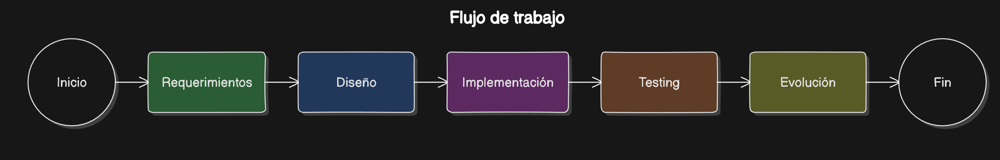
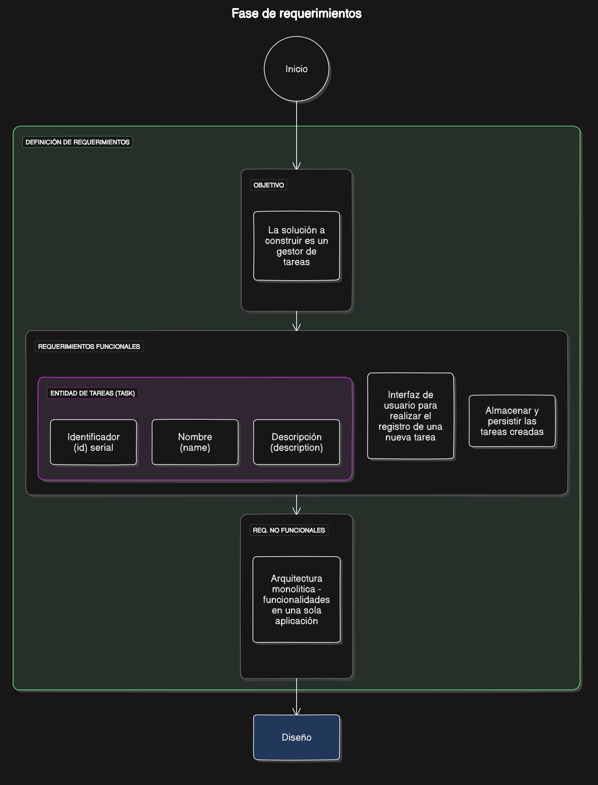
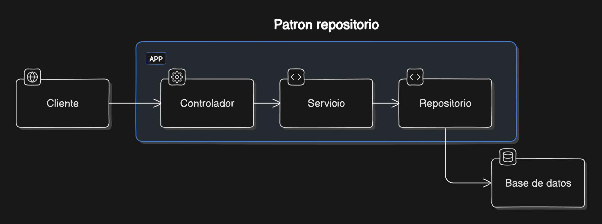

# Delivery 1 - Software Engineering - ISBN_MO

Santiago Suarez Suarez

07 de Octubre, 2024

[Repositorio del proyecto](https://github.com/ssbeater/unal-arquitectura-software-basada-nube/tree/main/isbn_mo)

---

# Flujo de trabajo


## Requerimientos



## Diseño


### Arquitectura del proyecto


### Patron repositorio



## Implementación


### Url del proyecto en Github

[Repositorio del proyecto](https://github.com/ssbeater/unal-arquitectura-software-basada-nube/tree/main/isbn_mo)

### Estructura del proyecto

```
isbn_mo/
├───controllers/
│   └───task_controller.py
├───models/
│   └───task.py
├───repositories/
│   └───task_repository.py
├───seed/
│   └───db-seed.py
├───services/
│   └───task_service.py
├───static/
│   └───styles.css
├───templates/
│   └───index.html
├───.dockerignore
├───.env
├───.env.template
├───.gitignore
├───app.py
├───docker-compose.dev.yml
├───docker-compose.yml
├───Dockerfile
├───Guia.ipynb
├───README.md
└───requirements.txt
```

### Docker compose - Correr el proyecto

```
services:

  isbn_db:
    image: mysql:latest
    restart: always
    environment:
      MYSQL_DATABASE: 'isbn_db'
      MYSQL_USER: 'user'
      MYSQL_PASSWORD: '123456'
      MYSQL_ROOT_PASSWORD: '123456'
    ports:
      - '3306:3306'
    volumes:
      - ./mysql:/var/lib/mysql

  isbn_app:
    build: .
    ports:
      - '4200:4200'
    depends_on:
      - isbn_db

```

## Testing


### Prueba en local corriendo docker


## Evolución


### Evidencia de cambios

[Link del commit en GitHub](https://github.com/ssbeater/unal-arquitectura-software-basada-nube/commit/c1c2914aed862bd14a91d632505adb34e916de77)


